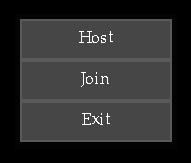

# tab-gui
A small gui-library using SDL.

### Features
* Buttons
* Text input
* Scrollbar
* Rendering via plain SDL or SDL-opengl

There is only one type of widget, the table. A table is filled with cells that can function as labels, buttons or input lines. You can attach custom render functions to cells to support something like styles or icons.
